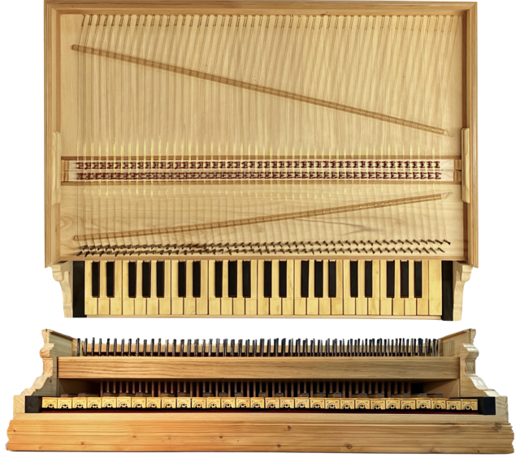
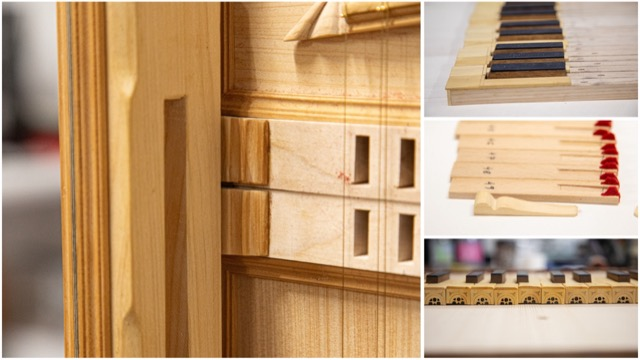
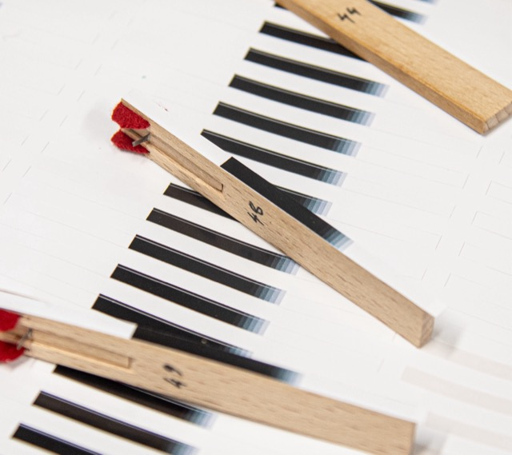
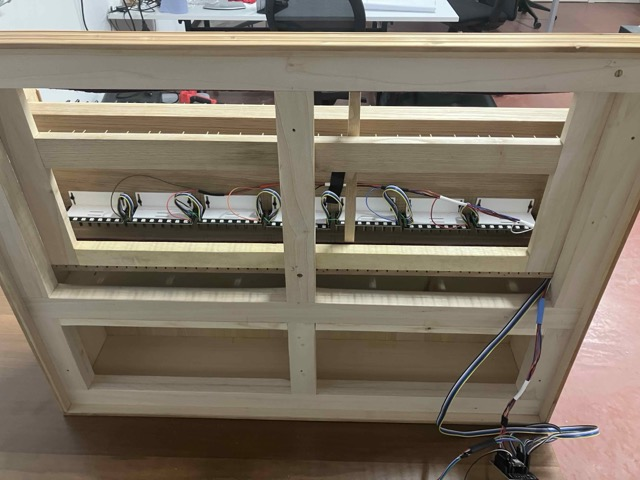
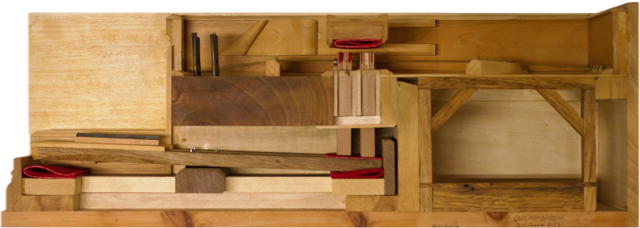
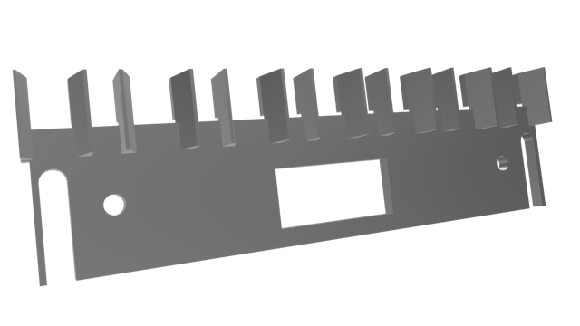
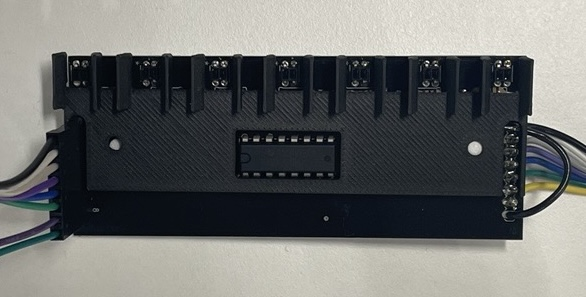
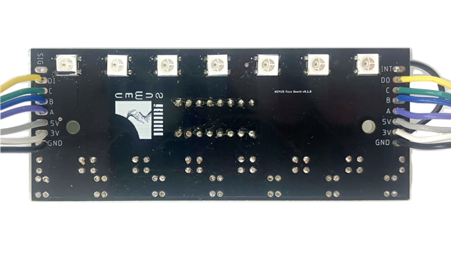
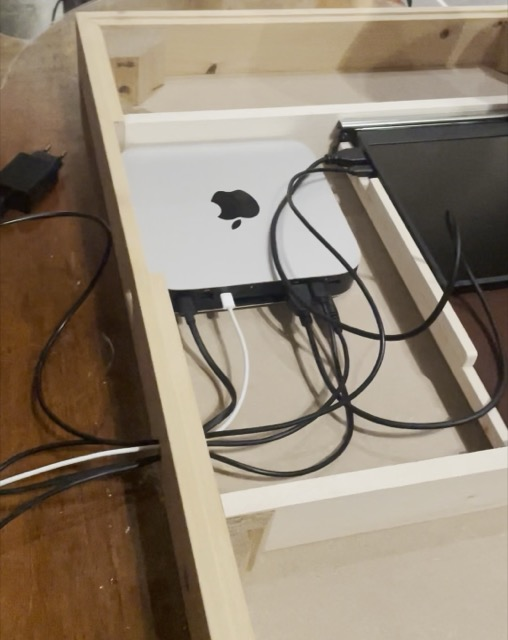
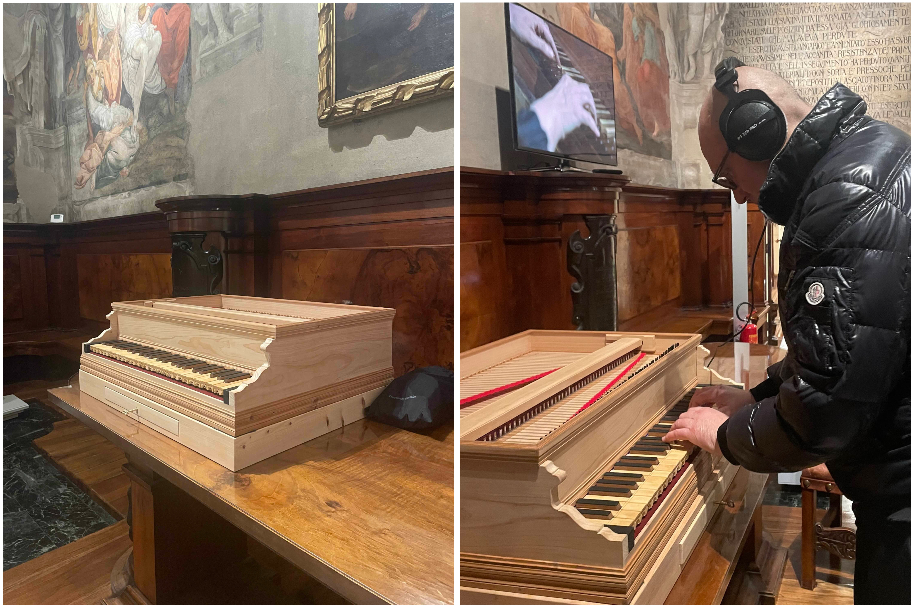

# Introduction

Technological advances have transformed how museums document, present
and interpret their collections. Immersive experiences are realised
through tools such as 3D printing and virtual reality (Allard et al.
2005; Wachowiak and Karas 2009; Music 2024; Kuzminsky and Gardiner 2012;
Schaich 2007). These technologies form a kind of experiential
authenticity, enabling encounters that evoke the past’s sensory,
emotional, and intellectual essence (Trant 1999). However, as Pine and
Gilmore note (Pine II and Gilmore, n.d.), achieving authenticity
requires museums to navigate the delicate balance between preservation
and meaningful engagement—a challenge that is particularly evident in
the case of historical musical instrument collections (McAlpine 2014).

Musical instruments represent a peculiar fusion of form, function, and
history. Their cultural value extends beyond their visual appeal to
include the tactile and auditory dimensions of use (Fritz et al. 2017).
Yet, preservation concerns often limit direct interaction, reducing
these artefacts to static displays. This “red velvet cord” approach, as
theorised by McAlpine (McAlpine 2014), protects fragile mechanisms but
diminishes the instruments’ functional identity, disconnecting visitors
from the full richness of their historical and cultural context.

The Collection in , housed at and renowned for its historical keyboard
instruments, exemplifies this dilemma. With over fifty early keyboard
instruments, primarily early plucked stringed keyboards of Italian
origin, the collection stands out as a valuable resource for
musicologists, organologists and musicians alike. Preserving the
instruments’ authenticity was the cornerstone of ’s vision. This guiding
principle led him to collect instruments that could be restored to their
playing condition after minimal intervention.

However, the delicate mechanisms of these instruments and their
historical significance mean they are only played under strict
conditions—by experienced historical keyboard performers or young
musicians under strict supervision from the curator. To enhance
accessibility and engagement, the museum commissioned the replica
(Figure <a href="#fig:teaser" data-reference-type="ref"
data-reference="fig:teaser">[fig:teaser]</a>) of a historical keyboard
built in the tradition of the Italian school, which is the subject of
this paper. The keyboard targets all visitors to the museum, regardless
of playing ability, and can be used without special permission. Jacks
that pluck two choirs of muted strings, across 49-keys, are used to
generate MIDI messages that are sent to a connected computer for audio
synthesis. The interface is presently linked to a commercial software
sampler; however, the ultimate aim is to make the sound of instruments
in the collection that can no longer be maintained in playable condition
accessible. Museum visitors are invited to play the interface and listen
through a pair of headphones. This work outlines the technological
aspects of the interface’s construction and offers reflections on its
role within the Collection and potential application within the wider
musical instrument museum context.

# Related Work and Motivations

Museums face a constant tension between accessibility and preservation,
restricting how visitors can interact with collections (Templeton 2018;
McAlpine 2014). For musical instrument museums, these challenges are
compounded by the difficulty of preserving historical instruments in a
playable condition (McAlpine 2014). The instruments’ inherent fragility
and gradual decay inevitably result in a point where they can no longer
be played, even when collections adhere to the strictest conservation
protocols (Paradiso 2019). A marked cultural change has taken place in
recent decades, shifting the focus from the playability of the originals
to their conservation. Karp (Karp 1979, 1985) advocates for a deeper
understanding of musical instruments so that enough knowledge is
generated to make them as “copyable” as possible.

As part of a broader initiative to enhance accessibility in museums, ,
within the cultural itinerary of , has developed a series of projects
aimed at improving cognitive and sensory access, supported by funding
from NextGenerationEU. The project seeks to leverage the museum’s
collection of musical instruments to create an immersive and interactive
engagement with the exhibited heritage. The reinterpretation of
historical musical objects through their tactile and auditory dimensions
is intended to make the exhibition more accessible to blind and
partially sighted visitors. The augmented keyboard aligns with these
objectives, serving as an important component of the initiative to
provide visitors of varying abilities with a hands-on, creative
experience within the museum.

McAlpine discusses a case similar to the collection in his examination
of the Benton Fletcher Collection at National Trust Fenton House
(McAlpine 2014). When these instruments were donated, Benton Fletcher
stipulated that they remain playable and should continue to be
maintained for tuition and public performance. A large sampling campaign
was conducted, and a custom MIDI interface was designed to fulfil this
requirement while preserving the original instruments’ integrity. The
MIDI controller, comprising two commercially available keyboards
mimicking the two-manual harpsichord layout, was used by visitors to
trigger the instrument samples recorded with tailored strategies for
each. However, user tests identified a limitation: the commercially
available weighted keys failed to provide an authentic sense of
interacting with a historical plucked keyboard instrument (McAlpine
2014).

On the other hand, the “Tromba Moderna” project (Baldwin et al. 2016), a
previous NIME initiative, approached the issue of musical heritage
playability by recreating and augmenting a replica of a historical
tromba marina. A piezo transducer was connected to a sound synthesis
engine and a driver within the instrument to simulate the expected
vibrations of a historical tromba marina.

The keyboard presented here inherits some aspects from the Tromba
Moderna project. The project aims to offer a tool to enhance the visitor
experience of the collection while retaining a form of continuity with
historical instrument-building traditions. However, the electronics
hidden inside the interface are not intended to augment or disrupt the
tactile feedback; rather, they serve as the silent and invisible link
between the mechanical and the digital realms.

The optical sensing technique for the keyboard is adapted from a similar
project on the piano by McPherson (A. McPherson 2013). As such, this
project extends the longevity of the results beyond the scope envisaged
in the original works, enhancing their sustainability, as discussed by
Masu *et al.* (Masu, Morreale, and Jensenius 2023). The intended use of
the keyboard through meaningful interaction with a museum exhibit is
where the novelty of this work lies, rather than solely in its
technological development.

Besides enhancing the visitor experience, future design iterations will
serve as a research tool to explore the unique characteristics of the
harpsichord and its impact on performance through the project , aiming
to virtually reproduce the sound of antique keyboard instruments, and
upcoming projects such as Rem@ke (Council 2024) investigating embodied
relationships between instrument and performer.

<figure id="fig:details">

<figcaption aria-hidden="true">Figure 1: Details of the replica,
including the key slots and sides, keys, and jacks with seagull
plectra.</figcaption>
</figure>

# Design Principles

The design of the augmented replica keyboard for the was guided by three
principal constraints stipulated by the museum:

- *Faithfulness*. The keyboard mechanism had to ensure fidelity to its
  authentic operation. The electronics system would not seek to ‘fix’ or
  ‘improve’ the limitations of the original design.

- *Robustness and reliability*. The system needed to accommodate
  frequent use by museum visitors and allow for straightforward
  maintenance by staff without requiring specialised technical
  expertise.

- *No visible electronic components*. To preserve the visual integrity
  of the exhibit, all electronic components had to remain concealed
  except for a pair of headphones and a small display for audio
  parameter adjustments.

- *Reduced use of space*. As museums often face space limitations, the
  instrument needed be compact enough not to compromise space for
  exhibition of the permanent display.

These constraints demanded an electronics system that was non-invasive
in design and respectful of the instruments’ historical aesthetics. The
requirement for faithfulness to the original mechanism immediately ruled
out a mechanical design reliant on electromechanical actuators, as in
previous works on piano haptics (Timmermans, Dehez, and Fisette 2020;
Gillespie 1996). While actuators can generate considerable force,
achieving a jack’s free motion and resistance is difficult without
extensive mechanical intervention such as that carried out by Gillespie
(Gillespie 1996).

The final design, shown in Figures
<a href="#fig:teaser" data-reference-type="ref"
data-reference="fig:teaser">[fig:teaser]</a> and
<a href="#fig:details" data-reference-type="ref"
data-reference="fig:details">1</a>, is a 49-key, two-register
harpsichord keyboard replica. Since the hosts primarily early plucked
stringed keyboards of Italian origin, the keyboard layout was
deliberately modelled after early Italian harpsichords, leveraging the
human tendency to be influenced by visual elements when making musical
judgments (Tsay 2013). This effect is particularly relevant in musical
instruments, as demonstrated by studies conducted by Fritz *et al.*
(Fritz et al. 2012, 2014, 2017). Instead of attempting to mitigate this
influence, the design embraces it. This phenomenon, akin to a ‘musical
instrument McGurk effect’, is one of the reasons why the electronics
have been concealed from view. The aesthetics of the interface enhance
its likelihood of being perceived as an ‘authentic’ musical instrument.
Given the extensive research into modelling and recreating piano action
(Cadoz, Lisowski, and Florens 1990; Gillespie 1996; Timmermans, Dehez,
and Fisette 2020), the visual component may provide the final persuasive
element necessary for acceptance, similar to the way visual perception
affects judgments of musical performance (Tsay 2013).

<figure id="fig:jack-tags">

<figcaption aria-hidden="true">Figure 2: Gradient stickers applied to
the side of the jack body. The coarse gradient scale was selected to
maximise signal excursion while preserving signal readout
stability.</figcaption>
</figure>

Optical sensors are positioned in front of each jack and their output
voltage depends on the amount of light reflected from a sensor surface.
In this case, the sensor surface is a grey-scale gradient printed on a
vinyl sticker (Figure <a href="#fig:jack-tags" data-reference-type="ref"
data-reference="fig:jack-tags">2</a>) and applied to the side of each
jack. Though the current configuration simply sends MIDI note-on and
-off messages when passing a threshold, the displacement of all jacks is
available continuously. The jacks for a single key typically have their
pluck points offset from each other, a practice known as ‘staggering’. A
combination of string tension, quill voicing, and jack staggering
contribute to the overall resistance of the action, with each key
differing from the low to the high octaves (Veroli 2012). The staggering
of the pluck point of the jacks between registers means that there are
two distinct tactile anchors along the key dip. The current sensor
system enables the data recording of traditional use from which it can
be identified where those opportunities for new expression lie (A. P.
McPherson, Gierakowski, and Stark 2013).

<figure id="fig:49-key-bottom">

<figcaption aria-hidden="true">Figure 3: Underside of the full model
keyboard, showing two chambers: the front chamber (top) and the rear
chamber (bottom).</figcaption>
</figure>

A modular system of printed circuit boards (PCBs) was designed to manage
the sensors and process their output. The system uses 49 optical sensors
distributed across seven boards containing 7 sensors each. The PCBs were
secured to the underside of the wrest plank and above the keys (Figure
<a href="#fig:49-key-bottom" data-reference-type="ref"
data-reference="fig:49-key-bottom">3</a>), allowing them to be adjusted
during installation. Ribbon cables connected the PCBs, providing
flexibility during assembly while maintaining a compact form factor.
Additional modifications, including baffles and adhesive improvements,
were made to optimise the reliability of the sensor system during
calibration and use.

The project expanded upon earlier NIME research on generating MIDI
messages from piano keystrokes (A. McPherson 2013), adapting it to
address the specific characteristics of harpsichords. Whereas the
previous design emphasised continuous gesture tracking, this
implementation required discrete key-triggered data to align with the
needs of MIDI-triggered audio playback.

## Materials and Construction

The keyboard was designed to replicate the tactile and aesthetic
sensations of playing a historical Italian harpsichord. Traditional
materials were used, including walnut for the wrest plank, chestnut for
the key levers, boxwood and ebony for key covers, and cypress for the
case and soundboard. The 98 jacks were made from beech, fitted with
brass springs and natural seagull feather plectra. The design was
inspired by the harpsichord at the , considered one of the first
prototypes to have been conceived with two sets of 8-foot strings. An
exception was made for the short octave — the assigning of common keys
in the first octave instead of a chromatic scale — typically found in
Italian harpsichords, which was replaced by a standard octave layout to
more easily accommodate the interaction with commercial sample
libraries.

<figure id="fig:log-harp-comp">
<figure id="fig:log-harp">

<figcaption>logarithmic shape</figcaption>
</figure>
<figure id="fig:rect-harp">

<figcaption>rectangular shape</figcaption>
</figure>
<figcaption>Figure 4: Logarithmic shape of an original harpsichord
contrast with the rectangular shape of the replica</figcaption>
</figure>

The rectangular poplar frame also deviates from the traditional
logarithmic (Figure
<a href="#fig:log-harp-comp" data-reference-type="ref"
data-reference="fig:log-harp-comp">6</a>) form to allow for the
installation of the electronic sensors, as visible in Figure
<a href="#fig:49-key-bottom" data-reference-type="ref"
data-reference="fig:49-key-bottom">3</a>, without compromising the
visual or tactile authenticity. Two string choirs, crafted from yellow
brass wire and anchored with wrought iron pins, were tensioned to
replicate authentic plucking resistance. Felt strips were added to
dampen vibrations. The result is an interface that combines the
mechanical action of keys with synthetic sound generation, preserving a
real harpsichord’s tactile qualities.

<figure id="fig:3key">

<figcaption aria-hidden="true">Figure 5: 3-Key Model Harpsichord
Mechanism </figcaption>
</figure>

## Project Deployment

A further objective, set forth by the authors, was to ensure
reproducibility by committing to an open source approach for all outputs
of the project. The commitment to open sourcing encompassed all aspects
of the system, including hardware schematics, firmware, and calibration
data. Cost-effectiveness was also a central consideration. Specifically,
the system was designed to be easily assembled using resources typically
available in a university-managed maker space. Components, such as
QRE1113 optical sensors and CD4051BE multiplexers, are widely available
from commercial resellers, while the modular PCB design ensures easy
replication and maintenance. The Arduino Nano was chosen as the core
microcontroller format for its compatibility with open source tools.
Calibration workflows were optimised using the Arduino IDE’s serial
plotter and open source MIDI Monitor software [^1], reducing reliance on
proprietary tools and simplifying the process for users.

Reference repositories for this project can be found here:

- *Firmware*:

- *PCB CAD*:

- *Interface Models*:

# Hardware Design

Figure <a href="#fig:system-block-diagram" data-reference-type="ref"
data-reference="fig:system-block-diagram">9</a> shows a block diagram of
the finalised hardware setup. The system evolved through iterative
prototyping, beginning with simple threshold-based testing and ending in
a fully functional multi-sensor interface capable of triggering MIDI
events.

## Prototype Stage

The initial stage of development focused on testing whether sensor data
could reliably trigger MIDI playback. Modifying an existing harpsichord
for testing was considered but ultimately discarded due to significant
internal measurement and layout discrepancies. Instead, a custom 3-key
harpsichord mechanism (Figure
<a href="#fig:3key" data-reference-type="ref"
data-reference="fig:3key">7</a>) was used as a foundation for
prototyping. This approach followed a methodology similar to that used
in Timmermans *et al.*’s Haptic Key project (Timmermans, Dehez, and
Fisette 2020), since the 3-key model enabled iterative testing of
individual components, including sensor placement, signal processing,
and mechanical tolerances, before upscaling.

The following criteria were established to guide sensor selection and
integration to make the system suitable for a museum context:

- *Non-invasiveness:* No remarkable modifications were allowed on the
  harpsichord mechanics, particularly on all the visible parts.

- *Low Latency:* The sampling period for reading and processing data
  from all sensors should remain under 10 ms to allow for latency
  introduced in other parts of the synthesis process. Empirical criteria
  found in previous studies (Jack, Stockman, and McPherson 2016) was
  used as a guide.

- *Reliability:* Sensor data should be dependable and consistent, with
  interference from anything external to the jack movement being absent
  or negligible.

- *Scalability:* The design needed to scale in both cost and time in
  order to be adaptable from a 3-key prototype (Figure
  <a href="#fig:3key" data-reference-type="ref"
  data-reference="fig:3key">7</a>) up to the 49 keys of the final
  design.

The hardware was designed to make assembly possible in standard
university maker spaces.

## Sensor Board

<figure id="fig:simple-schematic">

<figcaption aria-hidden="true">Figure 6: Optical sensor in a simple
voltage divider circuit. <code>V_OUT</code> is routed to one of 8
channels on the CD4051BE multiplexer.</figcaption>
</figure>

The final sensor system utilised QRE1113 optical sensors, known for
their small form factor, low cost, and suitability for short-range
distance detection (A. McPherson 2013; Moro and McPherson 2020). The
sensors were distributed across seven printed circuit boards, each
responsible for seven keys. Each PCB contained the following components:

- 7 QRE1113 optical sensors.

- 7 100 *Ω* resistors and 7 10 k*Ω* resistors (later reduced to one
  resistor per board).

- 1 Texas Instruments CD4051BE multiplexer for signal aggregation.

- 7 WS2812 RGB LEDs with integrated driver.

<figure id="fig:system-block-diagram">
<embed src="img/block-diagram-2.pdf" />
<figcaption aria-hidden="true">Figure 7: Block diagram of PCB
connections. A separate sensor signal is routed to the Arduino. LED and
multiplexer (MUX) controls signal are daisy-chained through each sensor
PCB.</figcaption>
</figure>

The optical sensors are wired in a voltage divider configuration (Figure
<a href="#fig:simple-schematic" data-reference-type="ref"
data-reference="fig:simple-schematic">8</a>) and the circuit outputs a
voltage based on the infrared light reflected from nearby surfaces. The
gradient stickers affixed to each jack provided a surface with varying
reflectivity for the sensors, which were used to track jack displacement
throughout the key dip.

<figure id="fig:baffles">

<figcaption aria-hidden="true">Figure 8: Baffles designed to prevent
cross-talk between adjacent sensors.</figcaption>
</figure>

3D-printed baffles were installed on the PCBs to eliminate cross-talk
between adjacent sensors, as per Figure
<a href="#fig:baffles" data-reference-type="ref"
data-reference="fig:baffles">10</a>. These baffles, fabricated from
dark-pigmented PLA, ensured that infrared reflections from neighbouring
jacks did not interfere with sensor readings. A manual visual check of
plotted all sensors readings confirmed that interference from
neighbouring jacks had been eliminated. RGB LEDs are placed on the
reverse side of the PCB, vertically in-line with the sensors, and were
added to provide a programmable means of providing visual feedback. The
LEDs are controlled via a pulse width modulation (PWM) signal and are
addressable individually. The output signal of the multiplexer is taken
from each PCB and routed to a separate ADC channel of the Arduino.
Multiplexer channel select and LED PWM signals are daisy-chained through
each PCB (Figure <a href="#fig:sensor-reverse" data-reference-type="ref"
data-reference="fig:sensor-reverse">11</a>).

## Controller Board

The controller board, designed around the Arduino Nano format, was the
central hub for processing sensor data and triggering MIDI messages. In
addition to solder terminals for the sensor board channels, the
controller board contained:

- 1 Arduino Nano 33 BLE.

- 1 Fujitsu MB85RS64 SPI Ferroelectric RAM chip.

- 1 EC11 combined rotary encoder and tactile switch.

The Arduino Nano’s small form factor made fitting the board inside the
harpsichord easier and also allowed for testing of multiple chipsets.
The 33 BLE variation of the Nano had the additional benefit in its
ability to be programmed as both native USB MIDI and BLE MIDI devices.
The 33 BLE was also able to achieve a sampling period of 1.7
milliseconds for all sensors. A 4-sample moving average filter was
implemented to reduce noise and brought the effective sampling period to
5.1 milliseconds.

Non-volatile memory, implemented using a Fujitsu MB85RS64 Ferroelectric
RAM (FRAM) chip, provided a reliable means of storing and preserving
calibration settings across power cycles. This ensured that sensor
thresholds and other settings could be preserved across power cycles,
enhancing the system’s usability in museums.

A rotary encoder was used as the interface to select a key, edit a
threshold and save current thresholds to the FRAM. Thresholds were first
set the midrange of possible values a a default. A rough calibration
process was carried out where each sensor were selected individually and
its readings were plotted against their current threshold value using
the Arduino IDE serial plotter. Thresholds were adjusted with the rotary
encoder until the key no longer passed the threshold line until the jack
had plucked the string. During calibration RGB LEDs were used as a
visual aid to quickly identify which key was currently being adjusted.
These LEDs also provided visual feedback during calibration, and would
change colour based on if readings were above below the threshold or if
the were outside previously recorded maximum or minimum values. Such use
of the LEDs meant for easy identification of malfunctioning sensors and
simplified the alignment process. A finer calibration process was
carried out with the guidance of expert harpsichord performer .

Power requirements for the system were estimated at 1.1 A at 5 V, with
some fluctuation when the system was first powered on. While the sensors
were powered continuously in this iteration, future designs may
incorporate power-saving measures, such as dynamic modulation of the
optical emitters found in the McPherson piano (A. McPherson 2013).

<figure id="fig:sensor-reverse">

 

<figcaption>Figure 9: Sensor board showing the sensor side (top) and
rear side with RGB LEDs and terminal connections (bottom). The
<code>SIG</code> terminal (Top Left) is routed to an ADC channel. Power
<code>5V, 3V, GND</code>, multiplexer channels <code>A, B, C</code> and
LED PWM input <code>DI</code> and output <code>DO</code> connect from
the previous sensor board (Left) and are routed to the next
(Right).</figcaption>
</figure>

For the initial version of the exhibition, a harpsichord sample library
was used and controlled via Native Instrument’s Kontakt[^2]. The
software was installed on a Mac Mini hosted inside the instrument’s
case. Holes were drilled at the back of the instrument’s frame, away
from sight, to allow the passage of cables, such as from power supplies,
USB connectors and headphone jack (Figure
<a href="#fig:mac-mini" data-reference-type="ref"
data-reference="fig:mac-mini">12</a>). An iPad is used as a monitor
through which visitors can adjust playback parameters such as tuning,
voicing and which stops are engaged.

<figure id="fig:mac-mini">

<figcaption aria-hidden="true">Figure 10: Components and cabling hidden
in the bottom section of the instrument case.</figcaption>
</figure>

# Discussion

The exhibition is set to open approximately a month after this work’s
submission, and only preliminary feedback has been collected from a pool
of 20 people – consisting of staff, surveillance personnel and visitors
who were given training on the system – and expert feedback from and .
Visitor feedback was collected through short informal interviews and
primarily to identify technical problems. The keyboard shows promise in
enhancing the museum experience as comments about a “sense of
disconnect” found in the Benton Fletcher Collection (McAlpine 2014) were
absent in this initial feedback.

A more formal surveying of museum visitors would be required to
determine to what degree the exhibition achieved its core aims. The
keyboard is hosted in the *Oratory* above the museum’s main hall, an
exceptional testimony to the Bolognese art, decorated by the finest
students of the Carracci and presenting a series of frescoes covering
most of the walls and ceiling. The room hosts unique examples of the
Italian Renaissance building tradition, including the 1547 harpsichord
and the 1540 spinet by . Visitors often visit the room with the same
caution and respect typical of worship spaces. Among the visitors
interviewed, no comments were made that the exposed headphones and
touchscreen affected such an experience negatively, though a more
definitive answer will come as more feedback is collected after launch.
Pictures of the keyboard hosted in the *Oratory* are shown in Figure
<a href="#fig:oratory" data-reference-type="ref"
data-reference="fig:oratory">13</a>.

Expert feedback has highlighted limitations, including imprecise key
calibration, which creates a temporal disconnect between the tactile
plucking sensation and sound onset. Additionally, the commercial sample
library, while allowing the selection of registers such as 8’, 4’, and
their combinations, restricts functionality to a single MIDI message per
key, regardless of the number of string choirs controlled. Inspired by
early Italian instruments, the keyboard’s layout is designed to manage
two 8’ registers with a sensor system fitted to each. Internally, the
instrument functions as two separate MIDI devices. However, one register
must be disengaged due to the software’s limited communication with only
a single device. While running multiple instances of the software is
possible, having two sets of GUI controls was considered too confusing
for visitors engaging with the exhibition without prior orientation.
Consequently, sensors are only active on single jacks to accommodate
these constraints. Future iterations could address these limitations
through technical improvements, such as refined calibration with
hysteresis and developing a custom sample library and interface.

<figure id="fig:oratory">

<figcaption aria-hidden="true">Figure 11: The keyboard installed in the
<em>Oratory</em> at , and a user wearing headphones playing
it.</figcaption>
</figure>

This work has incorporated and developed further the ideas of reusing
and complimenting the ‘old’ in digital musical instrument design as put
forward in the article ‘The *O* in NIME’ (Masu, Morreale, and Jensenius
2023). By integrating historical keyboard-building traditions with
digital augmentation, it offers a possibility to extend the practical
lifespan of musical heritage while maintaining the tactile qualities of
the original instrument. Rather than prioritising technical novelty, the
project demonstrates how digital interventions can support multi-modal
interaction with a shared musical heritage, ensuring its continued
relevance in contemporary museum contexts.

A longer discussion, but one going beyond the scope of this work, is
whether the current setup or its future iterations may be effectively
used to build legitimate replicas of historical musical instruments or
even become a kind of *new* musical instrument altogether. As such, the
question is whether these designs may result in music being practised,
performed and recorded with the instruments. This work supports an
overarching narrative extending beyond its application in museum
collections. The , focusing on developing advanced physical models
simulating the non-linear interaction between subcomponents, has
commissioned a second keyboard to further explore the role of control
interfaces in performance, employing the sense of touch as link between
the mechanical world with the digital, replicating the embodied
relationships between performer and instrument and offering
opportunities to modify or even disrupt these interactions. The upcoming
Rem@ke project (Council 2024) has also expressed an interest in engaging
with the keyboard to explore meaningful embodied interactions between
players and instruments.

The construction of the keyboard received funding from NextGenerationEU
within the framework of the accessibility project for the Removal of
Physical and Cognitive Barriers in Museums, Libraries and Archives:
Sound Heritage No Limits, in the Museum of San Colombano in Bologna -
CUP: C38J23000040001 - in the context of PNRR, Mission 1. MH and MD’s
work was supported by the European Commission’s Horizon2020 programme
through grant .

We acknowledge the invaluable contributions of

- Università di Bologna

  - *Alma Labor*: Massimiliano Fraulini and the staff of Alma Labor at
    the Università di Bologna for their 3D printing expertise and
    generosity with electronics equipment

  - *Fisica Tecnica*: Maurzio Chendi, Fabrizio Casarini, Giulio Severo
    and Barbara Costantini

- University of Edinburgh

  - *uCreate*: Simeon, Stuart, Izzy, and Ruth of uCreate at the
    Univeristy of Edinburgh for their support with soldering facilities.

  - *Edinburgh College of Art*: Richard Collins and the Digital Making
    Staff at the Edinburgh College of Art for 3D printing instruction
    and CNC support. Digital Development Technician Joe Hathaway

  - *St Cecilia’s*: Curator Dr. Jenny Nex

# Ethical Standards

This work is an empirical study of a keyboard system and involved no
research participants. The authors obtained explicit consent to collect
feedback. Seagull feathers, employed as a building material for the
jacks, were ethically sourced and collected along the Pesaro coastline.

Allard, Travis, Myra Sitchon, Roland Sawatzky, and Robert Hoppa. 2005.
“Use of Hand-Held Laser Scanning and 3D Printing for Creation of a
Museum Exhibit.” In *6th International Symposium on Virtual Reality,
Archaelogy and Cultural Heritage*. Pisa, Italy.

Baldwin, Alex, Troels Hammer, Edvinas Pechiulis, Peter Williams, Dan
Overholt, and Stefania Serafin. 2016. “Tromba Moderna: A Digitally
Augmented Medieval Instrument.” In *Proceedings of the International
Conference on New Interfaces for Musical Expression*, 14–19. Brisbane,
Australia: Queensland Conservatorium Griffith University.
<https://doi.org/10.5281/zenodo.3964592>.

Cadoz, Claude, Leszek Lisowski, and Jean-Loup Florens. 1990. “A Modular
Feedback Keyboard Design.” *Computer Music Journal* 14 (2): 47–51.

Council, European Research. 2024. “ERC Synergy Grants 2024.” 2024.
<https://erc.europa.eu/sites/default/files/2024-11/erc-2024-syg-results-all-domains.pdf>.

Fritz, Claudia, Joseph Curtin, Jacques Poitevineau, Hugues Borsarello,
Indiana Wollman, Fan-Chia Tao, and Thierry Ghasarossian. 2014. “Soloist
Evaluations of Six Old Italian and Six New Violins.” *Proceedings of the
National Academy of Sciences - PNAS* 111 (20): 7224–29.

Fritz, Claudia, Joseph Curtin, Jacques Poitevineau, Palmer
Morrel-Samuels, and Fan-Chia Tao. 2012. “Player Preferences Among New
and Old Violins.” *Proceedings of the National Academy of Sciences -
PNAS* 109 (3): 760–63.

Fritz, Claudia, Joseph Curtin, Jacques Poitevineau, and Fan-Chia Tao.
2017. “Listener Evaluations of New and Old Italian Violins.”
*Proceedings of the National Academy of Sciences - PNAS* 114 (21):
5395–5400.

Gillespie, Brent. 1996. “Haptic Displays of Systems with Changing
Kinematic Constraints: The Virtual Piano Action.” Master’s thesis,
Stanford, California: Stanford University.
<https://ccrma.stanford.edu/files/papers/stanm92.pdf>.

Jack, Robert H., Tony Stockman, and Andrew McPherson. 2016. “Effect of
Latency on Performer Interaction and Subjective Quality Assessment of a
Digital Musical Instrument.” In *ACM International Conference Proceeding
Series*, 4-06-:116–23. New York, NY, USA: ACM; ACM.

Karp, Cary. 1979. “Restoration, Conservation: Repair and Maintenance:
Some Considerations on the Care of Musical Instruments.” *Early Music* 7
(1): 79–84.

———. 1985. “Musical Instruments in Museums.” *The International Journal
of Museum Management and Curatorship* 4 (2): 179–82.

Kuzminsky, Susan C., and Megan S. Gardiner. 2012. “Three-Dimensional
Laser Scanning: Potential Uses for Museum Conservation and Scientific
Research.” *Journal of Archaeological Science* 39 (8): 2744–51.

Masu, Raul, Fabio Morreale, and Alexander Refsum Jensenius. 2023. “The o
in NIME: Reflecting on the Importance of Reusing and Repurposing Old
Musical Instruments.” In *Proceedings of the International Conference on
New Interfaces for Musical Expression*, edited by Miguel Ortiz and Adnan
Marquez-Borbon, 106–15. Mexico City, Mexico.
<https://doi.org/10.5281/zenodo.11189120>.

McAlpine, Kenneth B. 2014. “Sampling the Past: A Tactile Approach to
Interactive Musical Instrument Exhibits in the Heritage Sector.” In
*Innovation in Music 2013*, edited by Russ Hepworth-Sawyer, J. Hodgson,
R. Toulson, and J. L. Paterson, 110–25. KES Transactions on Innovation
in Music. Future Technology Press.
<http://inmusic13.innovationinmusic.com/>.

McPherson, Andrew. 2013. “Portable Measurement and Mapping of Continuous
Piano Gesture.” In *Proceedings of the International Conference on New
Interfaces for Musical Expression*, 152–57. Daejeon, Republic of Korea:
Graduate School of Culture Technology, KAIST.
<https://doi.org/10.5281/zenodo.1178610>.

McPherson, Andrew P., Adrian Gierakowski, and Adam M. Stark. 2013. “The
Space Between the Notes: Adding Expressive Pitch Control to the Piano
Keyboard.” In *Conference on Human Factors in Computing Systems -
Proceedings*, 2195–2204. New York, NY, USA: ACM.

Moro, Giulio, and Andrew McPherson. 2020. “A Platform for Low-Latency
Continuous Keyboard Sensing and Sound Generation.” In *Proceedings of
the International Conference on New Interfaces for Musical Expression*,
edited by Romain Michon and Franziska Schroeder, 97–102. Birmingham, UK:
Birmingham City University. <https://doi.org/10.5281/zenodo.4813253>.

Music, Royal College of. 2024. “3D Printed Musical Instruments.” 2024.
<https://www.rcm.ac.uk/research/projects/3dprintedmusicalinstruments/>.

Paradiso, Max. 2019. “To Save the Sound of a Stradivarius, a Whole City
Must Keep Quiet.” 2019.
<https://www.nytimes.com/2019/01/17/arts/music/stradivarius-sound-bank-recording-cremona.html>.

Pine II, Joseph .B., and James H. Gilmore. n.d. “Museums and
Authenticity.” *Museum News*.
<https://northernlight.nl/wp-content/uploads/Pine-and-Gilmore-Museums-and-Authenticity.pdf>.

Schaich, Martin. 2007. “From 3D Scanning to Analytical Heritage
Documentation.” In *Lasers in the Conservation of Artworks*, edited by
J. Nimmrichter, W. Kautek, and M. Schreiner, 463–71. Berlin, Heidelberg:
Springer Berlin Heidelberg.

Templeton, Cheryl A. 2018. “Museum Visitor
Engagement Through Resonant, Rich and Interactive Experiences,”
July. <https://doi.org/10.1184/R1/6723569.v1>.

Timmermans, Sébastien, Bruno Dehez, and Paul Fisette. 2020.
“Multibody-Based Piano Action: Validation of a Haptic Key.” *Machines* 8
(4). <https://doi.org/10.3390/machines8040076>.

Trant, Jennifer. 1999. “When All You’ve Got Is ‘the Real Thing’: Museums
and Authenticity in the Networked World.” *Archives and Museum
Informatics* 12 (2): 107–25.

Tsay, Chia-Jung. 2013. “Sight over Sound in the Judgment of Music
Performance.” *Proceedings of the National Academy of Sciences - PNAS*
110 (36): 14580–85.

Veroli, Claudio Di. 2012. “Optimising Harpsichord Staggering.”
*Harpsichord and Fortepiano* 16: 8–13.

Wachowiak, Melvin J., and Basiliki Vicky Karas. 2009. “3D Scanning and
Replication for Museum and Cultural Heritage Applications.” *Journal of
the American Institute for Conservation* 48 (2): 141–58.

[^1]: <https://github.com/krevis/MIDIApps>

[^2]: [Kontakt
    webpage](https://www.native-instruments.com/en/products/komplete/samplers/kontakt-8/?srsltid=AfmBOorKUf43SoIxGBS2-GnXmKHHkgcfcfWRskpweDhLSG3FiF0qrf2w)
    (accessed 31 Jan 2025)
